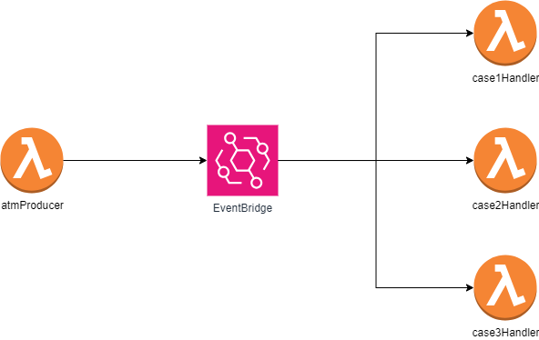

# Arquitectura Orientada a Eventos

## Definición

- La arquitectura basada en eventos utiliza eventos para desencadenar y establecer comunicación entre servicios desacoplados.
- Un evento es un cambio de estado, o una actualización dentro de una página web o un servicio de nube. Por ejemplo: La subida de un nuevo elemento en S3.
- Los eventos pueden llevar el estado (el elemento comprado, su precio y una dirección de entrega) o pueden ser identificadores (una notificación de que se envió una orden).

Las arquitecturas impulsadas por eventos tienen tres componentes clave: 
1) Productor de eventos
2) Enrutadores de eventos
3) Consumidores de eventos. 

Un productor publica un evento para el enrutador, que filtra y envía los eventos a los consumidores. Los servicios del productor y los servicios del consumidor se desacoplan, lo que les permite escalarse, actualizarse e implementarse de manera independiente.

## Beneficios:

- <b>Escalado y errores por separado: </b> Al separar los servicios, estos solo están conectados al enrutador de eventos y no entre sí. Esto implica que los servicios son interoperables, pero si uno de ellos experimenta un error, los demás continúan funcionando sin interrupciones. El enrutador de eventos actúa como un buffer elástico que se ajusta a picos repentinos de carga, proporcionando flexibilidad ante aumentos imprevistos en la demanda.

- <b>Auditar con facilidad: </b> Un enrutador de eventos cumple la función central de ser un lugar para auditar la aplicación y establecer políticas. Estas políticas pueden controlar quién tiene permisos para publicar y suscribirse al enrutador, así como gestionar el acceso de usuarios y recursos a los datos. Además, se ofrece la opción de cifrar los eventos tanto durante su transmisión como en reposo, asegurando la seguridad de la información.

- <b>Desarrollar con agilidad: </b> La necesidad de escribir código personalizado para sondear, filtrar y enrutar eventos se elimina al emplear un enrutador de eventos. Este enrutador realiza automáticamente estas tareas, filtrando y enviando los eventos a los consumidores de manera eficiente. Además, al desacoplar los servicios productores y consumidores, se simplifica el proceso de desarrollo, eliminando la necesidad de una coordinación intensiva entre ellos.

- <b>Reducción de costos: </b> Las arquitecturas basadas en eventos operan en un modelo push, lo que implica que las acciones ocurren bajo demanda al presentarse un evento en el enrutador. Esta metodología elimina la necesidad de pagar por sondeos continuos para verificar la existencia de eventos. En consecuencia, se reduce el consumo de ancho de banda de red, la carga en la CPU, la necesidad de mantener flotas de recursos ociosos y se disminuyen los handshakes SSL/TLS, contribuyendo a la optimización de costos.

## ¿Cuándo utilizar esta arquitectura?

- <b>Replicación de datos entre cuentas y regiones: </b> La utilización de una arquitectura orientada a eventos ofrece la posibilidad de coordinar sistemas entre equipos que operan y se implementan en diversas regiones y cuentas. Al emplear un enrutador de eventos para la transferencia de datos entre sistemas, se facilita el desarrollo, escalabilidad e implementación de servicios de forma independiente a otros equipos.

- <b>Procesamiento en paralelo y distribución ramificada: </b> Cuando se cuenta con numerosos sistemas que necesitan operar en respuesta a un evento, una arquitectura basada en eventos permite distribuir dicho evento sin requerir la creación de código personalizado para su envío a cada consumidor. El enrutador se encarga de enviar el evento a los sistemas, posibilitando que cada uno de ellos procese el evento en paralelo con objetivos distintos.

- <b>Supervisión del estado de los recursos y alertas: </b> En lugar de realizar comprobaciones continuas sobre los recursos, la adopción de una arquitectura basada en eventos posibilita la supervisión y recepción de alertas ante cualquier anomalía, cambio o actualización. Estos recursos abarcan desde buckets de almacenamiento y tablas de bases de datos hasta funciones sin servidor y nodos de computación, entre otros.

- <b>Integración de sistemas heterogéneos: </b> En presencia de sistemas que operan en diferentes pilas tecnológicas, una arquitectura basada en eventos se convierte en una herramienta valiosa para compartir información entre ellos sin generar acoplamientos. El enrutador de eventos establece la indirecta y la interoperabilidad entre los sistemas, permitiendo el intercambio de mensajes y datos sin comprometer su independencia.

# Amazon EventBridge

Amazon EventBridge es un servicio de eventos completamente administrado que facilita la creación, administración y enrutamiento de eventos en la nube. Proporciona una infraestructura sin servidores para la ingestión y entrega de eventos entre aplicaciones o servicios en la nube. EventBridge permite la construcción de arquitecturas orientadas a eventos y simplifica la integración entre diferentes servicios de AWS y aplicaciones externas.

## Características Clave de Amazon EventBridge

1. **Ingestión de Eventos:**
   - Permite la ingestión de eventos desde diversas fuentes, incluyendo servicios de AWS, aplicaciones personalizadas y SaaS externos.

2. **Enrutamiento de Eventos:**
   - Facilita el enrutamiento de eventos mediante reglas basadas en condiciones, permitiendo vincular eventos específicos a destinos específicos.

3. **Arquitectura sin Servidores:**
   - Elimina la necesidad de gestionar infraestructura, permitiendo a los usuarios configurar reglas y conectar aplicaciones o servicios de manera sencilla.

4. **Integración con Servicios de AWS:**
   - Total integración con otros servicios de AWS, posibilitando la fácil conexión con eventos generados por servicios como AWS Lambda, Amazon S3, Amazon SQS, entre otros.

5. **Integración con Aplicaciones Personalizadas:**
   - Permite la conexión con aplicaciones personalizadas y eventos provenientes de fuentes externas mediante la publicación de eventos a un bus de eventos.

6. **Modelo de Publicador/Consumidor:**
   - Sigue el modelo de publicador/consumidor, donde los productores generan eventos y los consumidores reaccionan a eventos específicos.

7. **Amplio Soporte de Eventos:**
   - Admite una variedad de eventos, incluyendo eventos de cambio de estado, eventos de error y eventos personalizados definidos por el usuario.

8. **Gestión de Eventos en Tiempo Real y por Lotes:**
   - Admite la entrega de eventos en tiempo real y en lotes, permitiendo manejar diferentes patrones de uso.

Amazon EventBridge se utiliza comúnmente para construir arquitecturas sin servidores y orientadas a eventos, siendo aplicable en diversos casos de uso, desde la automatización de flujos de trabajo hasta la integración de aplicaciones y la gestión de eventos en tiempo real.

# Demo

Para demostrar el uso de EventBridge, se ha planteado una prueba de concepto de esta tecnología. El contexto de la aplicación es un ATM que genera eventos según ciertas condiciones de las transacciones bancarias que se realicen. Para ello, se ha creado una aplicación que está conformado por 4 funciones lambda, que se van a explicar a continuación:

- atmProducer: Es una función Lambda productora que va a llamar a EventBridge. Esta función enviará data del archivo events.js, la cual contiene un arreglo de objetos que representan las transacciones bancarias.
- EventBridge: Va a recibir como parámetro las transacciones bancarias, las cuales las va a procesar según las reglas establecidas. Si cumple una regla en específico, entonces se ejecutará la función lambda consumidora correspondiente.
- case1Handler: Esta función lambda se va a ejecutar solo si la transacción tiene como result = approved.
- case2Handler: Esta función lambda se va a ejecutar solo si la location comienza con NY
- case3Handler: Esta función lambda se va a ejecutarse si el result != approved.  

## Requerimientos

* AWS CLI ya configurado
* NodeJS 16.x instalado 

## ¿Cómo funciona?

- Se invoca a la función Producer, la cual envía los objetos de events.js al bus de eventos de EventBridge.
- La regla de EventBridge especificada en `template.yaml` filtra los eventos según los criterios en la sección de `EventPattern`
- Cuando la regla valida el evento, se invoca la función consumidora correspondiente. Solo se imprime el evento, el cual sería visible en `CloudWatch Logs`

Vídeo Demostración:  https://ulima-edu-pe.zoom.us/rec/share/-kACVVnCF9_XiBRlq5zJWwXldHbfVvlHzIo6NYTe12DpUrjNHTUHGK6RbY4ww6yL.LYg1Z5iUzYZNk5D6

